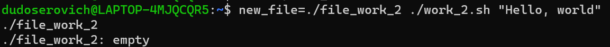
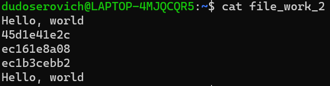

# work-2
## Задание
Реализовать BASH-скрипт с передачей переменных окружения и аргументов и использованием утилит find и file (опционально использование конструкций if и for).

### Скрипт:
```bash
#!/bin/bash

if [ -e $new_file ]; then
        find $new_file
        file $new_file
        for _ in {1..5}; do
                random=$(($RANDOM%2))
                #echo $random
                if (( random == 0 )); then
                        echo "$1" >> $new_file
                else
                        cat /dev/urandom | head -n 10 | md5sum | head -c 10 >> $new_file
                        echo "" >> $new_file
                fi
        done
fi
```
### Запускаем скрипт

### Смотрим что записалось
